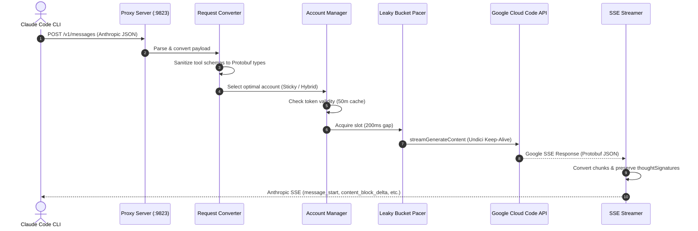
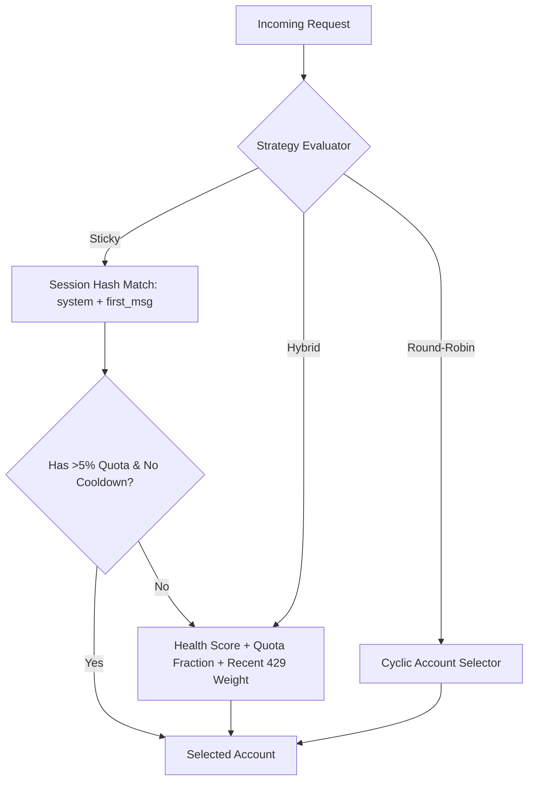

# Antigravity Claude Proxy — Deep Technical Architecture & Operational Guide

## 1. Executive Summary & Purpose

**Antigravity Claude Proxy** (`antigravity-claude-proxy`) is a high-performance local API gateway that bridges the **Anthropic Claude Messages API (`/v1/messages`)** with **Google's Cloud Code / Vertex AI internal LLM infrastructure**.

It allows standard Anthropic developer tools (such as **Claude Code CLI**, Cursor, Roo-Code, and custom Anthropic SDK clients) to transparently execute prompts against Google's frontier models (including Claude 3.7 Sonnet, Claude 3.5 Sonnet, Claude 3.5 Haiku, Gemini 2.5/3.6/3.7 Flash & Pro) using pooled Google Cloud accounts with quota management, session persistence, and multi-turn thinking support.

```mermaid
graph LR
    subgraph Client ["Anthropic Clients"]
        CC["Claude Code CLI"]
        SDK["Anthropic SDK / IDEs"]
    end

    subgraph Proxy ["Antigravity Claude Proxy (:9823)"]
        Router["Express Server & Auth"]
        Converter["Protocol Converter & Schema Sanitizer"]
        AccMgr["Account Manager & Hybrid Strategy"]
        Pacer["Per-Account Leaky Bucket Pacer"]
        UndiciPool["Undici HTTP Keep-Alive Pool"]
        SSE["SSE Parser & Realtime Streamer"]
        UI["WebUI & Virtualized Log Engine"]
    end

    subgraph Upstream ["Google Cloud Code AI Infrastructure"]
        TPU["Cloud Code Pa API (daily/prod)"]
        OAuth["Google OAuth Token Servers"]
    end

    CC -->|POST /v1/messages| Router
    SDK -->|POST /v1/messages| Router
    Router --> Converter
    Converter --> AccMgr
    AccMgr --> Pacer
    Pacer --> UndiciPool
    UndiciPool -->|streamGenerateContent| TPU
    TPU -->|SSE Stream| SSE
    SSE -->|Anthropic SSE Events| CC
    AccMgr -.->|Token Refresh (50m TTL)| OAuth
```

---

## 2. Port & Process Topology

| Port | Service | Role | Visibility |
| :--- | :--- | :--- | :--- |
| **9823** | `antigravity-claude-proxy` | **Main Gateway & WebUI**: Anthropic API emulator, token cache, account pooler, and management console. | Localhost (`http://localhost:9823`) |
| **9825** | `antigravity forward proxy` | Headless forward proxy for AGY IDE sessions. | Headless daemon |

---

## 3. End-to-End Request Translation Pipeline

When an Anthropic client issues a request to `POST /v1/messages`, the proxy executes the following 8-step pipeline:



### Step 1: Request Ingestion & Model Mapping
* Incoming Anthropic model identifiers are mapped to Google Cloud Code internal model identifiers:
  * `claude-3-7-sonnet-20250219` $\rightarrow$ `claude-3-7-sonnet` (or `gemini-3.7-flash-tiered` depending on configuration).
  * `claude-3-5-haiku-20241022` $\rightarrow$ `claude-3-5-haiku`.
  * Direct Gemini models (`gemini-2.5-flash`, `gemini-3.7-pro`).

### Step 2: Message & System Instruction Conversion
* Anthropic's top-level `system` string/array is converted into Google's `systemInstruction.parts[{ text: ... }]`.
* Conversation history (`messages: [{ role, content }]`) is converted to Google's `contents: [{ role: 'user'|'model', parts }]`.
* Multi-modal content (base64 images) is converted to Google's `inlineData: { mimeType, data }`.

### Step 3: Tool Definition & Schema Sanitization (`schema-sanitizer.js`)
* Google's internal Protobuf serializer has strict typing rules compared to standard JSON Schema:
  1. **Protobuf Uppercase Types**: Converts `string`, `number`, `integer`, `boolean`, `array`, `object` into `STRING`, `NUMBER`, `INTEGER`, `BOOLEAN`, `ARRAY`, `OBJECT`.
  2. **Unsupported Keyword Stripping**: Removes keywords unsupported by Google Protobuf (`additionalProperties`, `default`, `$schema`, `definitions`, `minLength`, `pattern`, etc.).
  3. **Union Flattening**: Flattens `anyOf`/`oneOf`/`allOf` down to the highest-scoring single concrete structure.
  4. **Clean Empty Schemas**: Empty schemas (`properties: {}`) are transmitted cleanly without synthetic required parameters, preventing client-side `InputValidationError` on parameterless tools like `EnterPlanMode` and `ExitPlanMode`.

---

## 4. Multi-Turn Reasoning & Thinking Signatures

Google Cloud Code Gemini 3+ and Claude 3.7 reasoning models emit **Thinking Blocks** alongside cryptographic **Thought Signatures** (`thoughtSignature`).

```
┌─────────────────────────────────────────────────────────────┐
│ Google Stream Chunk:                                        │
│ {                                                           │
│   "thought": true,                                          │
│   "text": "Analyzing AST...",                                │
│   "thoughtSignature": "eJy1mFlzm0oQx..."                    │
│ }                                                           │
└──────────────────────────────┬──────────────────────────────┘
                               │ Converted by sse-streamer.js
                               ▼
┌─────────────────────────────────────────────────────────────┐
│ Anthropic Stream Event:                                     │
│ event: content_block_delta                                  │
│ data: {"type":"thinking_delta","thinking":"Analyzing AST..."}│
│                                                             │
│ event: content_block_delta                                  │
│ data: {"type":"signature_delta","signature":"eJy1mFlz..."}  │
└─────────────────────────────────────────────────────────────┘
```

* **Signature Cache (`signature-cache.js`)**: Signatures are cached in memory indexed by `tool_use_id` and model family. In subsequent conversational turns, when Claude Code echoes tool results, the proxy re-injects the necessary signatures into Google's input parts to preserve TPU thinking context without causing signature mismatch errors.

---

## 5. Multi-Account Pooling & Selection Strategies

The proxy manages up to 50 Google accounts stored in `~/.config/antigravity-proxy/accounts.json`.



### 1. Hybrid Strategy (Default)
Combines three dynamic metrics:
$$\text{Score}(A) = w_q \cdot \text{RemainingQuota}(A) + w_h \cdot \text{HealthScore}(A) - w_e \cdot \text{ErrorPenalty}(A)$$
* **Health Score**: Tracks consecutive successes, recent latency, and error rates.
* **Quota Weighting**: Prioritizes accounts with higher remaining quota allowances.
* **429 Cooldown Isolation**: Temporarily locks an account upon receiving a rate limit without failing the client request, seamlessly rotating to the next available account.

### 2. Sticky Strategy (TPU Prompt Cache Optimization)
* Extracts a deterministic session key based on `hash(system_prompt + first_user_message)`.
* Keeps routing multi-turn tool interactions to the **exact same Google account**.
* **Benefit**: Google's TPU hardware maintains the pre-computed prefix KV-cache for that session, speeding up response generation by **2–3×** and drastically reducing token quota consumption (`cachedContentTokenCount`).

### 3. Account Auto-Recovery & 403 Rotation
* Detects Google OAuth `VALIDATION_REQUIRED` / `ACCOUNT_DISABLED` errors, marks the affected account `isInvalid = true`, captures the Google recovery URL, and automatically rotates the request to a healthy account without interrupting the developer's CLI workflow.

---

## 6. Performance & Network Optimizations

```
┌───────────────────────────────────────────────────────────────────────────┐
│                      Performance Subsystem Layer                          │
├───────────────────────────────────────────────────────────────────────────┤
│ 1. Undici HTTP Keep-Alive Pool (60s idle / 10m max / 50 persistent conns)  │
│ 2. Per-Account Leaky Bucket Pacer (200ms outbound throttle per account)   │
│ 3. 50-Minute OAuth Token Caching (reduces token roundtrips by 90%)       │
│ 4. Request Deduplication (deduplicates concurrent quota fetch queries)     │
│ 5. Virtualized DOM & RAF Micro-batching in WebUI (60 FPS rendering)      │
└───────────────────────────────────────────────────────────────────────────┘
```

1. **Persistent Connection Pooling (`undici.Agent`)**:
   * Initialized in `src/utils/helpers.js` with `keepAliveTimeout: 60000` and `connections: 50`.
   * Completely eliminates TLS/TCP handshakes (150–300ms overhead) across consecutive agent tool-use turns.
2. **Per-Account Leaky Bucket Pacer**:
   * Enforces a minimum 200ms spacing between outbound requests **per individual Google account**.
   * Replaced the legacy global sequential promise lock, allowing concurrent requests across different accounts while preventing upstream burst rate limits on any single account.
3. **50-Minute Token Cache TTL**:
   * Google OAuth access tokens have a 3600s (60 minute) lifespan. The proxy caches access tokens for 50 minutes (`3,000,000 ms`), eliminating unnecessary blocking OAuth refresh roundtrips before prompt generation.

---

## 7. WebUI & Monitoring Console (`http://localhost:9823`)

The management interface is built on a responsive Alpine.js + Tailwind CSS architecture:

* **Asynchronous Lazy Tab Loading**: HTML views (`dashboard.html`, `accounts.html`, `models.html`, `logs.html`, `settings.html`) are downloaded and initialized only upon first tab activation.
* **Log Stream Micro-Batching & Windowing**:
  * Incoming SSE log events are queued and flushed to the DOM using `requestAnimationFrame` at 60 FPS.
  * Windowing maintains a capped DOM list (250 items) with a `▲ Load earlier logs` loader, keeping browser memory low and preventing UI freezes during massive test runs.
* **In-Place Chart Updating**: Chart.js graphs update datasets in-place via `chart.update('none')` without destroying 2D canvas contexts.

---

## 8. Directory & Source Code Layout

```
antigravity-claude-proxy/
├── src/
│   ├── server.js               # Express application, routes & middleware
│   ├── config.js               # Global configuration defaults & disk sync
│   ├── constants.js            # Model constants, ports & TTL values
│   ├── account-manager/        # Multi-account state, OAuth & strategies
│   │   ├── index.js            # Core AccountManager coordinator
│   │   ├── credentials.js      # OAuth refresh & project discovery
│   │   ├── storage.js          # accounts.json persistence
│   │   └── strategies/         # Hybrid, Sticky & Round-Robin algorithms
│   ├── cloudcode/              # Google Cloud Code Pa API integration
│   │   ├── request-builder.js  # Google payload constructor
│   │   ├── streaming-handler.js# Retrying stream orchestrator
│   │   ├── sse-streamer.js     # Real-time Google -> Anthropic SSE generator
│   │   └── session-manager.js  # TPU Prompt cache session hash resolver
│   ├── format/                 # Bi-directional format transformation
│   │   ├── request-converter.js# Anthropic -> Google converter
│   │   ├── response-converter.js# Google -> Anthropic non-streaming converter
│   │   ├── schema-sanitizer.js # JSON Schema -> Protobuf sanitizer
│   │   └── signature-cache.js  # Thought signature multi-turn cache
│   └── utils/
│       ├── helpers.js          # Undici pool & leaky bucket pacer
│       └── logger.js           # Memory log ring-buffer & SSE broadcaster
├── public/                     # Frontend WebUI (HTML, Alpine.js, Tailwind CSS)
└── tests/                      # Integration & unit test suites
```

---

## 9. Typical Usage & Quick Start

```bash
# 1. Start or verify proxy daemon
systemctl --user status antigravity-proxy.service

# 2. Configure Claude Code to route through the proxy
export ANTHROPIC_BASE_URL=http://localhost:9823
export ANTHROPIC_API_KEY=dummy
claude

# 3. Open WebUI Dashboard
xdg-open http://localhost:9823/#dashboard
```
